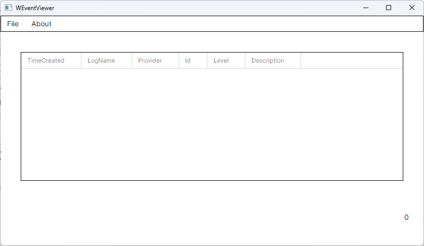
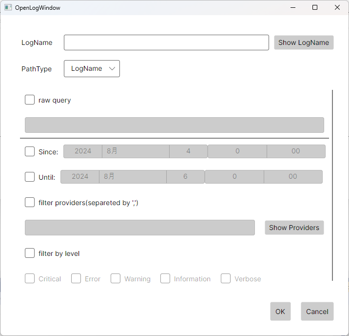

# Windows Event Viewer

This program is viewer for Windows EventLog

# Usage

1. download archive from [release page](https://github.com/itn3000/WEventViewer/releases)
2. extract file
3. execute WEventViewer.exe

* select "File"-"Open", and input search condition, then eventlog will be loaded
    * if "PathType" = "LogName" is selected, read event log from current machine
    * if "PathType" = "FilePath" is selected, read event log from exported event log file(evtx)
    * [raw query's format](https://learn.microsoft.com/en-us/windows/win32/wes/consuming-events)
* double click on log, then open detailed log information
* select log and right-click and select "Copy as XML" in context menu, then EventLog XML will be copied to clipboard

# Screen Shots

MainWindow:

OpenLogWindow:

# ChangeLog

## 0.2.0

* add eventlog level filter
* add show providers on OpenLogWindow
* add show lognames on OpenLogWindow

## 0.1.0

Initial Release